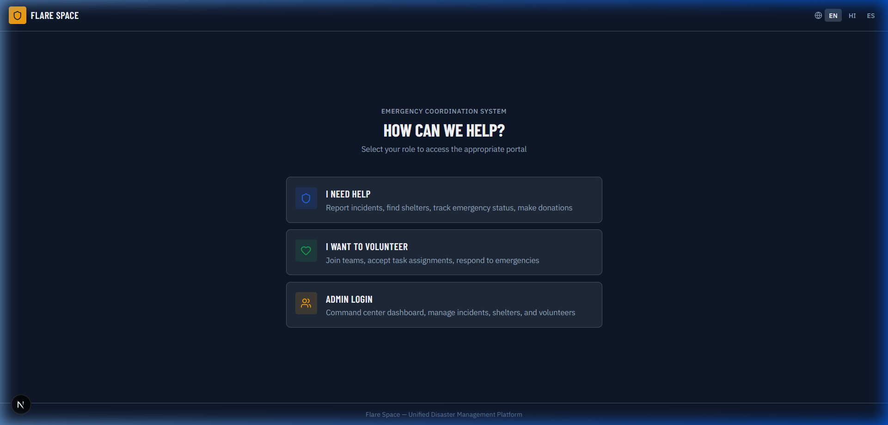
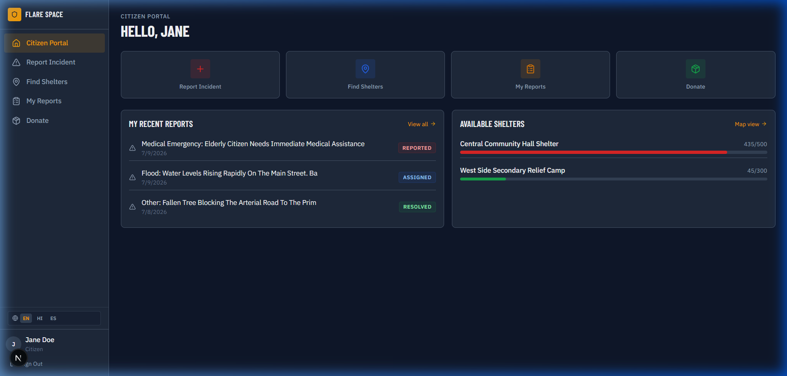
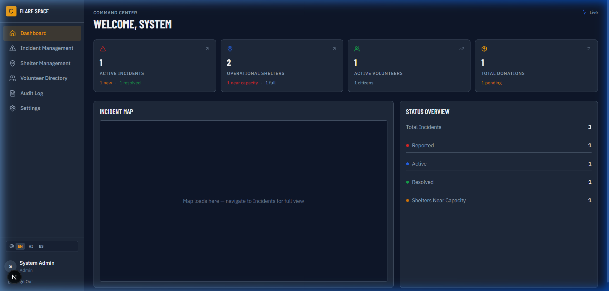
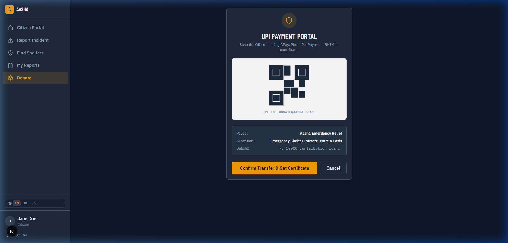
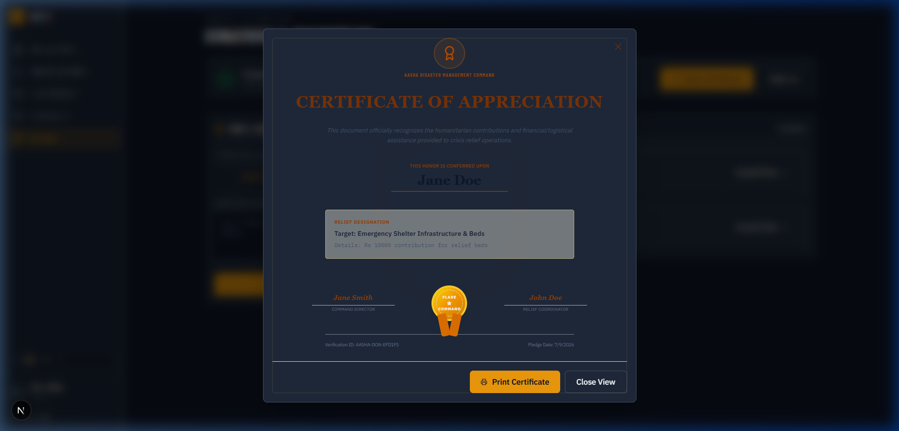
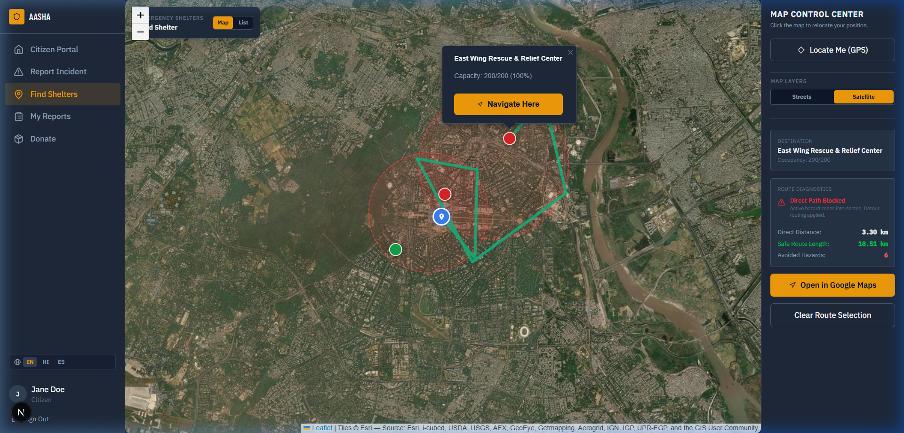
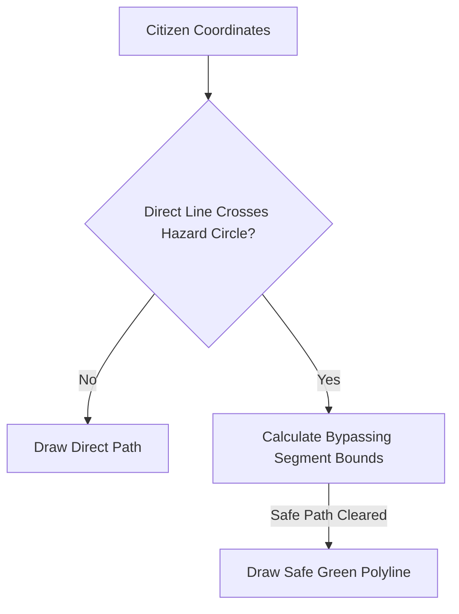

# Aasha — Disaster Relief & Crisis Command Center

A unified, real-time crisis response and disaster management system built to connect Citizens, Emergency Volunteers, and System Administrators during active disasters. Featuring dynamic danger-zone route detouring, secure QR payment simulation, and a live Command Center dashboard.

---

## Interface Showcases

### System Landing Portal
The System Landing Portal is the gateway to the Aasha platform, serving as a unified entry point for citizens, emergency responders, volunteers, and system administrators. The landing interface features a responsive layout designed with a sleek dark theme, introducing the system's core capabilities and offering direct navigation channels for target roles. Users can quickly learn about platform statistics, select their localized language interface, and log in securely to access personalized panels.



### Citizen Command Dashboard
The Citizen Command Dashboard provides community members with a localized control board to report emergency incidents and locate relief operations. The page integrates an operational sidebar for toggling between reporting forms, shelter listings, donation pledges, and profile configurations. Built with responsive glassmorphic cards, the interface lists active user reports, shows local hazard status codes, and ensures critical information is accessible at a single glance during dynamic crisis events.



### Central Administration Dashboard
The Central Administration Dashboard serves as the central command console for dispatchers and coordinators. It integrates top-level Key Performance Indicators (KPIs) summarizing active incidents, operational shelter counts, active volunteers, and pending donations. The interface divides into a real-time Leaflet map displaying reported crises and a comprehensive donations management log, allowing admins to track and verify relief contributions dynamically.



### Secure UPI Payment Verification Flow
The Secure UPI Payment Verification Flow is an intermediate checkout layout presented to citizens making financial contributions. Designed to replicate real-world payment interactions, it displays a mock UPI QR code alongside details for target allocations (such as medical support or food logistics). Citizens can scan the code using standard UPI client applications and click to verify the transfer, triggering the official transaction record.



### Gilded Certificate of Appreciation
The Gilded Certificate of Appreciation is a premium, print-ready document awarded to citizens upon completing a relief pledge. It features a luxury ivory-parchment background, double gilded-gold borders, formal cursive signatures, and a ribbon-bound golden wax seal stamp. The certificate dynamically pulls donor names and reference IDs from backend databases, offering print stylesheets that hide external navigation frames for standard layout printing.



### Full-Screen Satellite Map & Safe Routing
The Full-Screen Satellite Map & Safe Routing interface is the core geographic tool of the citizen portal. Panning across a Leaflet viewport, the map supports toggling between streets and Esri Satellite imagery tiles. It overlays red circular danger zone indicators mapping active disaster areas and calculates detour vectors. When a citizen clicks 'Navigate Here', it computes a detoured safe green path around threats, accompanied by external Google Maps direction links.



---

## Key Subsystem Roles & Features

### Citizen Interface
* **Emergency Dispatch Reports:** Citizens can quickly flag incidents (e.g., floods, fires, structural hazards) specifying category, severity level (1 to 5), descriptions, and map locations.
* **Low-Risk Shelter Navigation:**
  * Displays operational shelters and active hazard zones in a unified full-screen Leaflet container.
  * **Dynamic Risk Detouring:** If the straight-line path between a citizen's coordinates and a shelter crosses an active hazard zone, the app runs segment calculations to bypass the warning radius and draw a low-risk green line.
  * **Layer Selection:** Seamlessly toggle between OSM Streets and Esri Satellite imagery.
  * **Google Maps Link:** Click "Open in Google Maps" to launch external direction services preloaded with origin-destination coordinates.
* **Scan-and-Pay Relief Contributions:**
  * Pledge financial donations targeting specific channels (e.g. Primary Medical, Water Logistics, Emergency Infrastructure).
  * Prompts a secure intermediate UPI Scan-and-Pay screen displaying a mock QR code and checkout details.
* **Gilded Gold Appreciation Certificates:**
  * Confirmed donations generate a high-contrast gilded certificate with dual gold border lines, cursive signature seals, and a ribbon-bound wax seal.
  * A persistent ledger history at the bottom allows downloading or printing certificates for past donations at any time.
* **Profile Map Configurator:** Dynamic view-centering Leaflet coordinate picker aligning user locale settings.

### Volunteer Interface
* **Task Grid Board:** Volunteers can inspect incoming assignments reported by citizens and claim them.
* **Team Coordination:** Join field relief squads based on credentials and active locations.
* **Geospatial Profiles:** Volunteers can center their status maps on active location markers to alert nearby dispatchers of their operational radius.

### Admin Command Center
* **Live System Metrics:** Top-level counters aggregated dynamically from database statistics (e.g., total active incidents, shelter occupancy ratios, active volunteers, pending pledges).
* **Command Map Overlay:** A Leaflet dashboard rendering operational shelter pins colored by capacity warnings alongside active hazard circles.
* **Contributions Ledger (Donatory Section):**
  * Displays a full-width logs ledger of all citizen donations.
  * Fully searchable by name, email, or details, with filter selections for category (Goods/Funds) and status.
  * **Administrative Status Dropdowns:** Changing a donation's status selector (e.g. from Pledged to Collected or Distributed) immediately updates the database records and refreshes the dashboard KPI counters.

---

## REST API Endpoints Reference

All requests must include a `Bearer <token>` authentication header for endpoints requiring user sessions.

| Method | Endpoint | Access Role | Description |
| :--- | :--- | :--- | :--- |
| **POST** | `/api/auth/register` | Public | Register a new platform account |
| **POST** | `/api/auth/login` | Public | Authenticate user credentials and retrieve a JWT session token |
| **GET** | `/api/auth/me` | Authenticated | Retrieve current session profile details |
| **PUT** | `/api/auth/me` | Authenticated | Update user profile settings (name, phone, language, location coords) |
| **GET** | `/api/incidents` | Authenticated | Retrieve a filtered list of incidents (limit/status) |
| **GET** | `/api/incidents/all` | Citizen, Vol, Admin | Fetch all platform incidents in database |
| **POST** | `/api/incidents` | Citizen, Admin | Submit a new disaster incident report |
| **GET** | `/api/shelters` | Authenticated | Fetch list of relief shelters |
| **GET** | `/api/donations` | Authenticated | Fetch donation logs (Citizens see own; Admins see all logs) |
| **POST** | `/api/donations` | Citizen | Create a new financial or supply donation pledge |
| **PUT** | `/api/donations/:id` | Admin | Update status of a donation pledge (pledged, collected, distributed) |
| **GET** | `/api/admin/stats` | Admin | Aggregate dashboard count statistics |
| **GET** | `/api/admin/export` | Admin | Backup data exporter (returns raw JSON collection dumps) |

---

## Design System Tokens & Styling

The frontend matches an advanced, high-contrast dark theme configured within `frontend/app/globals.css`:

### Color Tokens
* **Background Surfaces:**
  * Primary Surface: `bg-surface-primary` (`#0F172A` - Deep slate)
  * Secondary Card Surface: `bg-surface-secondary` (`#1E293B` - Mid slate)
  * Hover Elevations: `bg-surface-elevated` (`#334155` - Light slate)
* **Borders:** `border-surface-border` (`rgba(255,255,255,0.08)`)
* **Accents:** `text-accent` / `bg-accent` (`#D97706` - Warm amber)
* **Badges:**
  * Active/Reported: `badge-info` (Blue tones)
  * Acknowledged/In-Progress: `badge-medium` (Orange tones)
  * Resolved: `badge-success` (Green tones)

### Font Tokens
* Monospace Font Family: configured for geographic coordinate prints and ID serial codes.
* Sans-Serif Font Family: optimized for high legibility under emergency dashboards.
* Serif Font Family: reserved specifically for Gilded Gold Certificates.

---

## Path Detour Algorithm

To compute routes that bypass emergency hazard overlays, the app performs the following checks:

1. **Overlap Detection:** A direct line segment is drawn between the user coordinates $A$ and the shelter coordinates $B$.
2. **Hazard Check:** The algorithm checks if this segment intersects any active danger circles of radius $R$.
3. **Point Deviation:** For each intersecting hazard, the route splits at the hazard's boundary, calculating alternative safe detour coordinates perpendicular to the danger threshold.
4. **Clean Merge:** The segment pieces are merged back into a low-risk green polyline path bypass.



---

## Multilingual Internationalization (next-intl)

The system supports localized translation keys stored under `frontend/public/locales/`:
- `en.json` — English
- `hi.json` — Hindi
- `es.json` — Spanish
- `ml.json` — Malayalam
- `or.json` — Odia
- `te.json` — Telugu
- `kn.json` — Kannada

Whenever a user updates their `languagePreference` in their Profile Settings, the client updates its translation context and dynamically changes vocabulary labels.

---

## Mock Data Layer Fallback

When a local MongoDB database connection is offline or unconfigured, the Express server switches to **Mock Database Fallback** mode.
- In-memory collection stores (`mockUsers`, `mockIncidents`, `mockDonations`, `mockShelters`) are initialized and read/write operations are mirrored locally in Node.js runtime memory.
- Enables offline standalone testing of administrative status updates, user details saves, and donation creation flows.

---

## Quick Start Installation

### Prerequisites
- Node.js ≥ 20.9
- MongoDB Atlas (Optional, falls back to memory-store if connection is refused)

### 1. Configure the API Backend
```bash
cd backend
cp .env.example .env       # Set MONGODB_URI and JWT_SECRET
npm install
npm run dev                 # Runs on http://localhost:5000
```

### 2. Configure the Next.js Frontend
```bash
cd frontend
cp .env.example .env.local  # Set NEXT_PUBLIC_API_URL
npm install
npm run dev                 # Runs on http://localhost:3000
```

---

## Seeding Account Credentials

| Role | Username | Password |
| :--- | :--- | :--- |
| **Citizen** | `citizen@aasha.space` | `password123` |
| **Volunteer** | `volunteer@aasha.space` | `password123` |
| **Admin** | `admin@aasha.space` | `admin123` |
